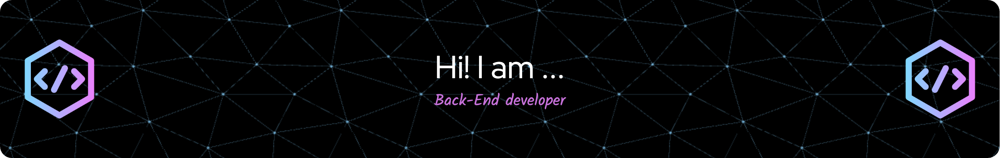

# The Latest Blog Posts.
<!-- BLOG-POST-LIST:START -->
- [Spring Rest Docs 공통 오브젝트 관리하기](https://velog.io/@dailyzett/Spring-Rest-Docs-%EA%B3%B5%ED%86%B5-%EC%98%A4%EB%B8%8C%EC%A0%9D%ED%8A%B8-%EA%B4%80%EB%A6%AC%ED%95%98%EA%B8%B0)
- [&#39;kotlinOptions&#39; is deprecated](https://velog.io/@dailyzett/kotlinOptions-is-deprecated)
- [API 규격서 서버로 도커 컨테이너와 Swagger 를 이용하기](https://velog.io/@dailyzett/API-%EA%B7%9C%EA%B2%A9%EC%84%9C-%EC%84%9C%EB%B2%84%EB%A1%9C-%EB%8F%84%EC%BB%A4-%EC%BB%A8%ED%85%8C%EC%9D%B4%EB%84%88%EC%99%80-Swagger-%EB%A5%BC-%EC%9D%B4%EC%9A%A9%ED%95%98%EA%B8%B0)
- [스프링 부트 2.3.x RELEASE -&gt; 2.7.14 마이그레이션](https://velog.io/@dailyzett/%EC%8A%A4%ED%94%84%EB%A7%81-%EB%B6%80%ED%8A%B8-2.3.x-RELEASE-2.7.14-%EB%A7%88%EC%9D%B4%EA%B7%B8%EB%A0%88%EC%9D%B4%EC%85%98)
- [싱글톤 디자인 패턴을 파헤쳐보자](https://velog.io/@dailyzett/%EC%8B%B1%EA%B8%80%ED%86%A4-%EB%94%94%EC%9E%90%EC%9D%B8-%ED%8C%A8%ED%84%B4%EC%9D%84-%ED%8C%8C%ED%97%A4%EC%B3%90%EB%B3%B4%EC%9E%90)
<!-- BLOG-POST-LIST:END -->

# Tech Stack.

